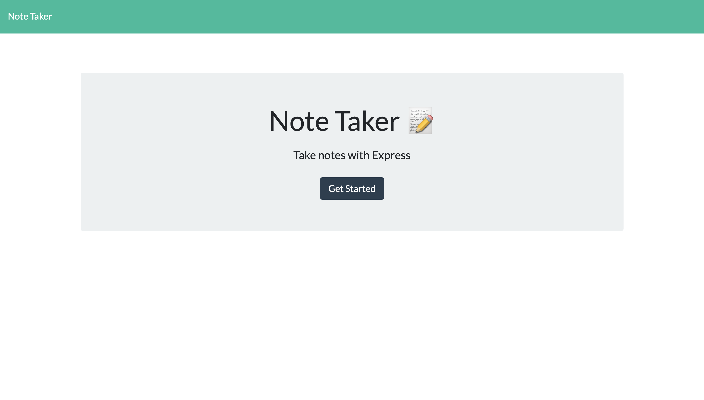
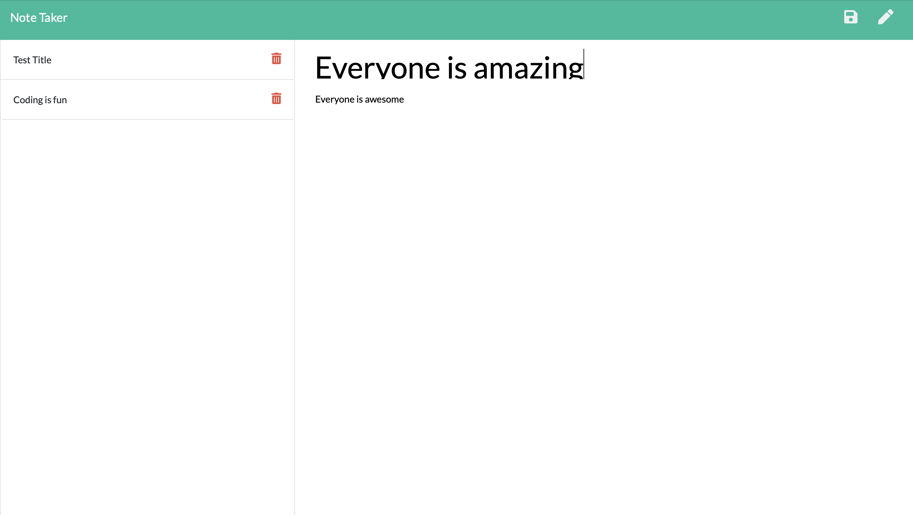
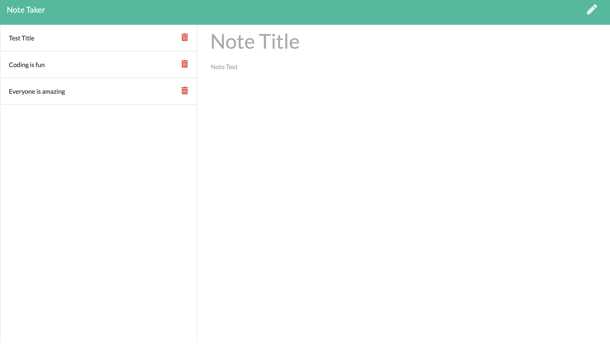

# Who like's to take notes?

**Developer: Teangelo Burks**
&nbsp;


## Goal: 
The goal was to modify starter code to create an application called Note Taker that can be used to write and save notes. This application will use an Express.js back end and will save and retrieve note data from a JSON file.

The frontend code was already created, Implementing the backend code was the main task.


## User Story

```
AS i come across idea's in my head
I WANT to be able to write and save them as a note
SO THAT I can keep track of my thoughts and view them when needed
```


## Acceptance Criteria

```
GIVEN a application when taking notes
WHEN I open the Note taking app
THEN I am presented with a page that says "get started"
WHEN I click the "get started " button
THEN I am taken to a new page
UPON heading to a new page
THEN I am presented with the option to type in a Note Title and Text
NEXT once i'm done with my note, i am presented with a save button
WHEN i hit save then my note will appear in the left-hand corner.

```

# Demonstration: 

Step 1: Select the Get Started button

&nbsp;
Step 2: Start typing out your note then hit the save icon in the top right-hand corner.


Step 3: Once your note is saved, you will be able to view the saved note in the left-hand column.



# Installation:
First step would be to download a IDE(Visual Studio Code), Next step would be to install node.js(Type in the terminal "install node" ), Once node is successfully installed, The next step is to install a package.json file(Type in the terminal "npm init"), Lastly you will want to install express.js for your server.

&nbsp;

# Usage:

Once node and all your packages are installed, run the file in the command line(node index.js ), the server will start listening on the port specified, Next open up your browser, then type " localhost:3001" to start saving you notes

# License:
None

# Technologies used:

* HTML
* CSS
* JavaScript
* Node.js
* Express.js

&nbsp;


# Contact Me
## Github Username: [Teangelo1](https://github.com/Teangelo1)
## Email: burks.teangelo@gmail.com